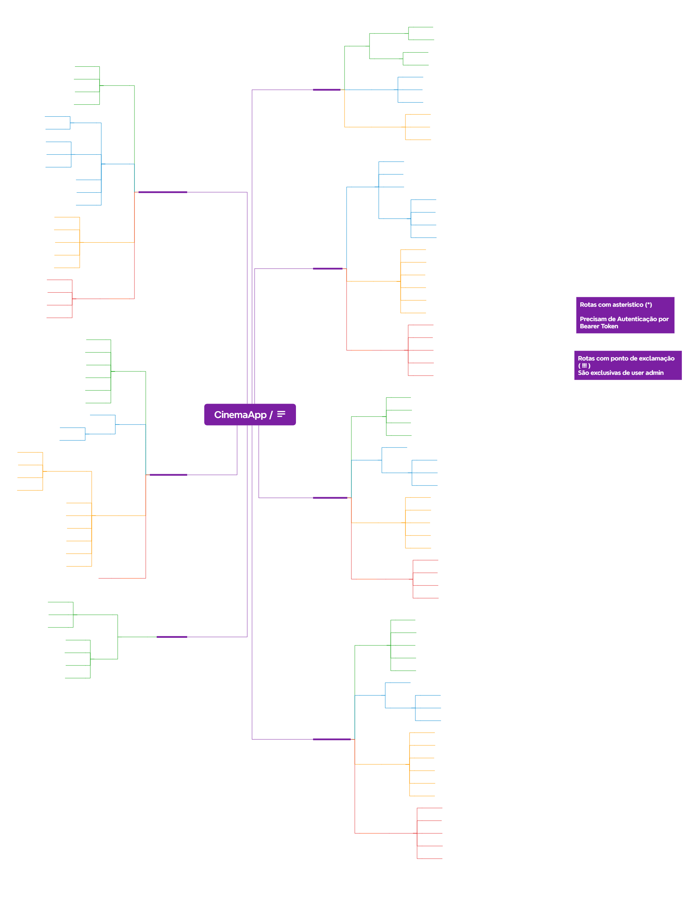

# **Plano de Testes: Aplicação Cinema Challenge (Back-end e Front-end)**

**Data de Elaboração:** 21 de Outubro de 2025

**Última Atualização:** 24 de Outubro de 2025

## 1. Apresentação

Este documento detalha o plano de testes para a aplicação **Cinema Challenge**, que consiste em uma API REST (back-end) e uma interface web (front-end). O back-end será acessível localmente (ex: `http://localhost:3000/`) e o front-end também (ex: `http://localhost:8080/`).

O foco deste planejamento é garantir a qualidade, a conformidade com as regras de negócio e a estabilidade de todos os componentes da aplicação, incluindo os endpoints da API (Autenticação, Usuários, Filmes, Theaters, Sessões, Reservas) e os fluxos de usuário na interface. Este plano servirá como guia para a análise, a criação de cenários, o mapeamento de issues e, principalmente, para o desenvolvimento do projeto de automação de testes com **Robot Framework**.

## 2. Objetivo

O objetivo principal é validar de forma sistemática a aplicação Cinema Challenge, tanto em sua camada de serviço (API) quanto na de apresentação (UI), para garantir que ela opere conforme o esperado.

### Objetivos Específicos:

* Validar as funcionalidades de **Autenticação** (`/auth/login`, `/auth/register`, `/auth/me`, `/auth/profile`).
* Validar as funcionalidades de **Gerenciamento de Usuários** (`GET /users`, `GET /users/{id}`, `PUT /users/{id}`, `DELETE /users/{id}`), incluindo restrições de Admin.
* Validar o **CRUD completo** do endpoint de `/movies`, incluindo as restrições de acesso por perfil (Admin).
* Validar o **CRUD completo** do endpoint de `/theaters`, incluindo as restrições de acesso por perfil (Admin).
* Validar o **CRUD completo** do endpoint de `/sessions` e a funcionalidade `reset-seats`, incluindo as restrições de acesso por perfil (Admin).
* Validar as funcionalidades de **Reservas** (`POST`, `GET /{id}` para usuário normal; `GET`, `PUT /{id}`, `DELETE /{id}` para Admin).
* Validar os **principais fluxos de usuário na interface web (front-end)** (Login, Home, Detalhes, Seleção de Assentos, Reserva, Minhas Reservas).
* Garantir que todas as **regras de negócio** e critérios de aceitação sejam atendidos em ambas as camadas.
* Identificar, documentar e reportar quaisquer divergências (**issues**) no repositório do GitHub.
* Produzir um **projeto de automação de testes robusto** com Robot Framework.

## 3. Escopo

### Funcionalidades em Escopo:

* **Back-end (API):**
    * **Autenticação (`/auth`):** Login (`POST /login`), Registro (`POST /register`), Ver Perfil (`GET /me`), Atualizar Perfil (`PUT /profile`).
    * **Usuários (`/users`):** Listar (`GET /users`), Buscar por ID (`GET /users/{id}`), Atualizar (`PUT /users/{id}`)!, Deletar (`DELETE /users/{id}`)!.
    * **Filmes (`/movies`):** Listar (`GET /movies`), Buscar por ID (`GET /movies/{id}`), Criar (`POST /movies`)!, Atualizar (`PUT /movies/{id}`)!, Deletar (`DELETE /movies/{id}`)!.
    * **Theaters (`/theaters`):** Listar (`GET /theaters`), Buscar por ID (`GET /theaters/{id}`), Criar (`POST /theaters`)!, Atualizar (`PUT /theaters/{id}`)!, Deletar (`DELETE /theaters/{id}`)!.
    * **Sessões (`/sessions`):** Listar (`GET /sessions`), Buscar por ID (`GET /sessions/{id}`), Criar (`POST /sessions`)!, Atualizar (`PUT /sessions/{id}`)!, Deletar (`DELETE /sessions/{id}`)!, Resetar Assentos (`POST /sessions/{id}/reset-seats`)!.
    * **Reservas (`/reservations`):** Criar (`POST /reservations`), Buscar por ID (própria) (`GET /reservations/{id}`), Listar Todas (`GET /reservations`)!, Atualizar (`PUT /reservations/{id}`)!, Deletar (`DELETE /reservations/{id}`)!.
* **Front-end (UI):**
    * Fluxo de Login.
    * Visualização da Home com Filmes.
    * Acesso à Página de Detalhes do Filme.
    * Fluxo de Seleção de Assentos e Reserva.
    * Visualização de "Minhas Reservas".

### Fora de Escopo:

* Testes de performance, carga ou estresse.
* Testes de usabilidade e acessibilidade aprofundados.
* Testes de infraestrutura ou segurança aprofundados (além da validação de permissões).

## 4. Análise

A análise será baseada na comparação direta entre os resultados obtidos nos testes automatizados (API e UI) e o comportamento esperado. Serão avaliados:

* **Status Codes HTTP:** (API) Conformidade com os padrões REST (200, 201, 204, 400, 401, 403, 404).
* **Corpo da Resposta (Response Body):** (API) Validação da estrutura (schema) e dos dados retornados.
* **Comportamento da Interface:** (UI) Renderização, navegação, interação e atualização de dados.
* **Regras de Negócio:** Validação de lógicas específicas (permissões Admin/User, unicidade, fluxo de reserva).

## 5. Técnicas Aplicadas

* **Teste Baseado em Especificação:** Uso das User Stories e do Mapa Mental da API.
* **Análise de Valor Limite:** Para campos com restrições numéricas ou de tamanho.
* **Particionamento de Equivalência:** Para campos com regras (formato de e-mail, tipos de role).
* **Teste de Transição de Estado:** Para validar fluxos sequenciais (API e UI).
* **Teste Baseado em Risco:** Foco nas permissões (Admin vs User) e rotas críticas (Reservas).
* **Teste de Robustez (Fuzzing):** Envio de dados malformados ou inesperados na API.

## 6. Ambiente e Recursos de Teste

### Local dos Testes
* Ambiente de desenvolvimento local.

### Ambiente de Testes (Hardware e Software)
* **Sistema Operacional:** Windows 11 (ou similar)
* **Hardware:** PC (Intel i5, 12GB RAM, 64 bits ou similar)
* **Software:**
    * Framework de Teste: **Robot Framework**
    * Bibliotecas: `robotframework-requests`, `robotframework-browser`, `robotframework-faker`, `robotframework-jsonlibrary`, `robotframework-jsonschemalibrary`
    * Banco de Dados (Auxiliar): MongoDB Compass (ou mongosh)
    * Editor de Código: VS Code
    * Controle de Versão: Git / GitHub
    * Gerenciamento de Testes: Jira

### Recursos Necessários
* **Humanos:** 1 Analista de Qualidade.
* **Equipamentos:** Computador com acesso à internet.

## 7. Mapa Mental da Aplicação (Estrutura da API)

```bash
CinemaApp API
├─── Auth
│    ├─── POST /login
│    ├─── POST /register
│    ├─── GET  /me                *
│    └─── PUT  /profile           *
│
├─── Users
│    ├─── GET /users               *
│    ├─── GET /users/{id}          *
│    ├─── PUT /users/{id}          *!  <-- ATUALIZADO (Admin Only)
│    └─── DELETE /users/{id}       *!
│
├─── Movies
│    ├─── POST /movies             *!
│    ├─── GET /movies
│    ├─── GET /movies/{id}
│    ├─── PUT /movies/{id}         *!
│    └─── DELETE /movies/{id}      *!
│
├─── Theaters
│    ├─── POST /theaters           *!  <-- ATUALIZADO
│    ├─── GET /theaters
│    ├─── GET /theaters/{id}
│    ├─── PUT /theaters/{id}       *!  <-- ATUALIZADO
│    └─── DELETE /theaters/{id}    *!  <-- ATUALIZADO
│
├─── Sessions
│    ├─── POST /sessions           *!
│    ├─── GET /sessions
│    ├─── GET /sessions/{id}
│    ├─── PUT /sessions/{id}       *!
│    ├─── DELETE /sessions/{id}    *!
│    └─── POST /sessions/{id}/reset-seats  *!  <-- NOVA ROTA ADICIONADA
│
└─── Reservations
     ├─── POST /reservations       * # User creates THEIR reservation
     ├─── GET /reservations        *! <-- ATUALIZADO (Admin lists ALL)
     ├─── GET /reservations/{id}   * # User gets THEIR reservation by ID
     ├─── PUT /reservations/{id}   *! <-- ATUALIZADO (Admin updates ANY)
     └─── DELETE /reservations/{id}  *! <-- ATUALIZADO (Admin deletes ANY)

------------------------------------------
Legenda:
(*)   Rota precisa de Token de Autenticação
(!)   Rota exclusiva para usuários Admin
(*!)  Rota Autenticada e de Admin
------------------------------------------
```
<div align="center">
  
  <figcaption>mindmap.png</figcaption>
</div>

## 8. Cenários de Teste Detalhados (BDD/Gherkin)

Esta seção detalha os casos de teste derivados das Histórias de Usuário (US) e do Mapa Mental da API. Cada caso possui um ID único (CTC) para rastreabilidade.

### **Feature: Autenticação (US-AUTH)**

#### US-AUTH-001: Registro de Usuário
**(Como visitante, quero registrar...)**
**Critérios:** Inserir dados, validar formato, impedir duplicados, redirecionar.

- **CTC-001 (UI):** Registro de novo usuário com sucesso pela interface
- **CTC-001_API (API):** Registro de novo usuário com sucesso pela API
- **CTC-002_API (API):** Tentativa de registro com e-mail já existente
- **CTC-003_API (API):** Tentativa de registro com formato de e-mail inválido

#### US-AUTH-002: Login de Usuário
**(Como usuário, quero fazer login...)**
**Critérios:** Inserir credenciais, autenticar válidas, manter sessão JWT, redirecionar.

- **CTC-004 (UI):** Login com credenciais válidas pela interface
- **CTC-004_API (API):** Login com credenciais válidas pela API
- **CTC-005 (UI):** Tentativa de login com senha incorreta
- **CTC-005_API (API):** Tentativa de login com credenciais inválidas pela API

#### US-AUTH-003: Logout de Usuário
**(Como usuário logado, quero sair...)**
**Critérios:** Logout via menu, invalidar sessão, remover token.

- **CTC-006 (UI):** Logout de usuário autenticado
- **CTC-007 (UI):** Tentativa de acesso a rota protegida após logout
- **CTC-007_API (API):** Tentativa de acesso a rota protegida com token inválido/expirado

#### US-AUTH-004: Visualizar e Gerenciar Perfil do Usuário
**(Como usuário logado, quero ver/atualizar perfil...)**
**Critérios:** Exibir dados, permitir edição, confirmar sucesso.

- **CTC-008 (UI):** Visualizar informações do perfil
- **CTC-008_API (API):** Visualizar informações do perfil pela API (`GET /auth/me`)
- **CTC-009 (UI):** Atualizar nome do perfil com sucesso
- **CTC-009_API (API):** Atualizar nome do perfil pela API (`PUT /auth/profile`)

### **Feature: Gerenciamento de Usuários (Admin)**
**(Derivado do Mapa Mental - PUT /users/{id})**

- **CTC-032_API (API):** Admin atualiza outro usuário com sucesso
- **CTC-032_NEGATIVE_UNAUTHORIZED_API (API):** Tentar atualizar outro usuário sem autenticação
- **CTC-032_NEGATIVE_FORBIDDEN_API (API):** Tentar atualizar outro usuário como usuário normal
- **CTC-033_API (API):** Tentar atualizar um usuário com ID inexistente (Admin)

### **Feature: Filmes e Sessões (US-MOVIE, US-SESSION)**

#### US-MOVIE-001: Navegar na Lista de Filmes
**(Como usuário, quero navegar pelos filmes...)**
**Critérios:** Visualizar lista, cards com info, acesso aos detalhes.

- **CTC-010 (UI):** Visualizar lista de filmes em cartaz
- **CTC-010_API (API):** Listar filmes pela API (`GET /movies`)
- **CTC-011 (UI):** Acessar detalhes de um filme a partir da lista

#### US-MOVIE-002: Visualizar Detalhes do Filme
**(Como usuário, quero ver detalhes do filme...)**
**Critérios:** Mostrar sinopse/elenco/etc., mostrar horários.

- **CTC-012 (UI):** Visualizar informações detalhadas de um filme
- **CTC-012_API (API):** Buscar detalhes de um filme pela API (`GET /movies/{id}`)

#### US-SESSION-001: Visualizar Horários de Sessões
**(Como usuário, quero ver horários...)**
**Critérios:** Mostrar horários disponíveis, permitir navegação para assentos.

- **CTC-013 (UI):** Navegar para seleção de assentos a partir de um horário
- **CTC-013_API (API):** Listar sessões de um filme pela API (`GET /sessions`)

### **Feature: Gerenciamento de Salas (Theaters) - Admin**
**(Derivado do Mapa Mental)**

- **CTC-023_API (API):** Listar todas as salas (Theaters) com sucesso (`GET /theaters`)
- **CTC-024_API (API):** Buscar uma sala (Theater) por ID existente (`GET /theaters/{id}`)
- **CTC-025_API (API):** Tentar buscar uma sala (Theater) por ID inexistente
- **CTC-026_API (API):** Criar uma nova sala (Theater) com sucesso (requer Admin - `POST /theaters`)
- **CTC-026_NEGATIVE_UNAUTHORIZED_API (API):** Tentar criar sala sem autenticação
- **CTC-026_NEGATIVE_FORBIDDEN_API (API):** Tentar criar sala como usuário normal
- **CTC-028_API (API):** Atualizar uma sala (Theater) existente com sucesso (requer Admin - `PUT /theaters/{id}`)
- **CTC-028_NEGATIVE_UNAUTHORIZED_API (API):** Tentar atualizar sala sem autenticação
- **CTC-028_NEGATIVE_FORBIDDEN_API (API):** Tentar atualizar sala como usuário normal
- **CTC-030_API (API):** Deletar uma sala (Theater) existente com sucesso (requer Admin - `DELETE /theaters/{id}`)
- **CTC-030_NEGATIVE_UNAUTHORIZED_API (API):** Tentar deletar sala sem autenticação
- **CTC-030_NEGATIVE_FORBIDDEN_API (API):** Tentar deletar sala como usuário normal

### **Feature: Gerenciamento de Sessões (Admin)**
**(Derivado do Mapa Mental)**

- **CTC-034_API (API):** Admin reseta assentos de uma sessão com sucesso (`POST /sessions/{id}/reset-seats`)
- **CTC-034_NEGATIVE_UNAUTHORIZED_API (API):** Tentar resetar assentos sem autenticação
- **CTC-034_NEGATIVE_FORBIDDEN_API (API):** Tentar resetar assentos como usuário normal
- **CTC-034_NEGATIVE_NOT_FOUND_API (API):** Tentar resetar assentos de sessão inexistente (Admin)

### **Feature: Reservas (US-RESERVE)**

#### US-RESERVE-001: Selecionar Assentos para Reserva
**(Como usuário logado, quero selecionar assentos...)**
**Critérios:** Visualizar layout, cores de disponibilidade, selecionar múltiplos, não selecionar ocupados, mostrar subtotal.

- **CTC-014 (UI):** Selecionar assentos disponíveis
- **CTC-015 (UI):** Tentativa de selecionar assento já reservado

#### US-RESERVE-002: Processo de Checkout
**(Como usuário logado, quero finalizar a compra...)**
**Critérios:** Redirecionar para checkout, mostrar resumo, permitir pagamento, confirmar reserva, marcar assentos como ocupados.

- **CTC-016 (UI):** Finalizar uma reserva com sucesso
- **CTC-016_API (API):** Criar uma reserva pela API (Usuário Normal - `POST /reservations`)
- **CTC-017_API (API):** Verificar se assentos ficam ocupados após reserva
- **CTC-017_NEGATIVE_API (API):** Tentar criar reserva para assento já ocupado

#### US-RESERVE-003: Visualizar Minhas Reservas
**(Como usuário logado, quero ver meu histórico...)**
**Critérios:** Acessar via menu, mostrar lista/cards, detalhes por reserva.

- **CTC-018 (UI):** Acessar e visualizar histórico de minhas reservas

### **Feature: Gerenciamento de Reservas (User & Admin - API)**
**(Derivado do Mapa Mental Atualizado)**

#### (Listar Todas - Admin)
- **CTC-035_API (API):** Admin lista todas as reservas com sucesso (`GET /reservations`)
- **CTC-035_NEGATIVE_UNAUTHORIZED_API (API):** Tentar listar todas sem autenticação
- **CTC-035_NEGATIVE_FORBIDDEN_API (API):** Tentar listar todas como usuário normal

#### (Buscar por ID - User/Admin)
- **CTC-036_API (API):** Usuário normal busca sua própria reserva por ID com sucesso (`GET /reservations/{id}`)
- **CTC-036_NEGATIVE_UNAUTHORIZED_API (API):** Tentar buscar por ID sem autenticação
- **CTC-036_NEGATIVE_FORBIDDEN_API (API):** Tentar buscar reserva de outro usuário como usuário normal
- **CTC-036_NEGATIVE_NOT_FOUND_API (API):** Tentar buscar reserva com ID inexistente
- **CTC-037_API (API):** Admin busca qualquer reserva por ID com sucesso (`GET /reservations/{id}`)

#### (Atualizar - Admin)
- **CTC-038_API (API):** Admin atualiza uma reserva com sucesso (`PUT /reservations/{id}`)
- **CTC-038_NEGATIVE_UNAUTHORIZED_API (API):** Tentar atualizar sem autenticação
- **CTC-038_NEGATIVE_FORBIDDEN_API (API):** Tentar atualizar como usuário normal

#### (Deletar - Admin)
- **CTC-039_API (API):** Admin deleta uma reserva com sucesso (`DELETE /reservations/{id}`)
- **CTC-039_NEGATIVE_UNAUTHORIZED_API (API):** Tentar deletar sem autenticação
- **CTC-039_NEGATIVE_FORBIDDEN_API (API):** Tentar deletar como usuário normal

### **Feature: Experiência do Usuário e Navegação (US-HOME, US-NAV)**

#### US-NAV-001: Navegação Intuitiva
**(Como usuário, quero navegar facilmente...)**
**Critérios:** Cabeçalho consistente, menu responsivo, acesso a áreas logadas, indicação visual.

- **CTC-019 (UI):** Verificar elementos da página inicial para visitante (Cobre US-HOME-001)
- **CTC-020 (UI):** Verificar elementos da página inicial para usuário autenticado (Cobre US-HOME-001)
- **CTC-021 (UI):** Verificar consistência do cabeçalho de navegação
- **CTC-022 (UI):** Verificar responsividade do menu de navegação

## 9. Priorização da Execução dos Cenários de Teste

| Prioridade | Critérios de Seleção | Exemplos de Cenários Priorizados |
|------------|---------------------|-----------------------------------|
| **ALTA** | Fluxos críticos (Login, Registro, Criação de Reserva - API/UI), CRUDs básicos (API). | CTC-001_API, CTC-004_API, CTC-016_API, CTC-004(UI), CTC-010_API, CTC-013_API. |
| **MÉDIA** | Testes negativos de regras de negócio importantes (duplicados, permissões), fluxos secundários (ver perfil, ver minhas reservas). | CTC-002_API, CTC-005_API, CTC-017_NEGATIVE_API, CTC-03x_NEGATIVE_FORBIDDEN_API, CTC-008_API, CTC-018(UI). |
| **BAIXA** | Testes de casos de borda (formatos inválidos, IDs inexistentes), validações de UI menos críticas (responsividade). | CTC-003_API, CTC-025_API, CTC-036_NEGATIVE_NOT_FOUND_API, CTC-022(UI). |

## 10. Matriz de Risco

| Risco Identificado | Impacto | Probabilidade | Plano de Contingência |
|-------------------|---------|---------------|----------------------|
| Ambiente local instável ou com bugs | Alto | Média | Isolar problema (front, back, automação). Reportar issues claras. Usar Docker para consistência. |
| Dados de teste inconsistentes | Médio | Média | Usar Test Setup/Teardown com criação/deleção via API ou DB (lib customizada) para garantir estado limpo. |
| Mudanças na API/UI sem aviso | Médio | Baixa | Comunicação com Devs. Focar em seletores robustos (UI) e validação de schema (API). Atualizar plano e testes. |
| Falha na validação de permissões (Segurança) | Alto | Média | Priorizar testes negativos de 401 Unauthorized e 403 Forbidden para todas as rotas restritas. |

## 11. Cobertura de Testes

### 11.1 Cobertura por Requisitos (Regras de Negócio)
**Objetivo:** 100% de cobertura das regras de negócio explícitas (User Stories) e implícitas (permissões do Mapa Mental).

### 11.2 Cobertura por Endpoints e Métodos HTTP (API)

| Rota | Método | Permissão | Coberto |
|------|--------|-----------|---------|
| /auth/login | POST | Pública | Sim |
| /auth/register | POST | Pública | Sim |
| /auth/me | GET | User (*) | Sim |
| /auth/profile | PUT | User (*) | Sim |
| /users | GET | User (*) | Sim |
| /users/{id} | GET | User (*) | Sim |
| /users/{id} | PUT | Admin (*!) | Sim |
| /users/{id} | DELETE | Admin (*!) | Sim |
| /movies | GET | Pública | Sim |
| /movies/{id} | GET | Pública | Sim |
| /movies | POST | Admin (*!) | Sim |
| /movies/{id} | PUT | Admin (*!) | Sim |
| /movies/{id} | DELETE | Admin (*!) | Sim |
| /theaters | GET | Pública | Sim |
| /theaters/{id} | GET | Pública | Sim |
| /theaters | POST | Admin (*!) | Sim |
| /theaters/{id} | PUT | Admin (*!) | Sim |
| /theaters/{id} | DELETE | Admin (*!) | Sim |
| /sessions | GET | Pública | Sim |
| /sessions/{id} | GET | Pública | Sim |
| /sessions | POST | Admin (*!) | Sim |
| /sessions/{id} | PUT | Admin (*!) | Sim |
| /sessions/{id} | DELETE | Admin (*!) | Sim |
| /sessions/{id}/reset-seats | POST | Admin (*!) | Sim |
| /reservations | POST | User (*) | Sim |
| /reservations | GET | Admin (*!) | Sim |
| /reservations/{id} | GET | User (*) | Sim |
| /reservations/{id} | PUT | Admin (*!) | Sim |
| /reservations/{id} | DELETE | Admin (*!) | Sim |

### 11.3 Cobertura por Fluxos de Usuário (UI)

| Fluxo de Usuário | Coberto |
|------------------|---------|
| Registro (Opcional, pode ser feito via API) | Parcial |
| Login | Sim |
| Visualização Home/Lista Filmes | Sim |
| Visualização Detalhes Filme/Sessões | Sim |
| Seleção de Assentos | Sim |
| Checkout e Confirmação Reserva | Sim |
| Visualização Minhas Reservas | Sim |
| Logout | Sim |

## 12. Estratégia de Automação (Robot Framework)

A automação será o entregável principal, utilizando Robot Framework para cobrir API e UI.

**Estrutura do Projeto:** Padrões Page Objects (UI) e Service Objects (API), separando lógica de teste da implementação. Schemas JSON para validação de API. Biblioteca Python customizada (lib/) para gerenciamento de dados de teste (conexão DB).

**Bibliotecas:** RequestsLibrary, BrowserLibrary, FakerLibrary, JSONLibrary, JsonSchemaLibrary, Collections, pymongo, bcrypt.

**Gerenciamento de Dados:** Criação dinâmica (FakerLibrary), criação/deleção via API e/ou conexão direta ao DB (lib/) em Test Setup/Teardown e Suite Teardown para garantir independência e limpeza.

**Estratégia de Execução:**
- **API Primeiro:** Priorizar automação da API para validação rápida de regras de negócio e permissões. Usar API para Setup/Teardown de testes de UI.
- **UI Focada em Fluxos:** Validar jornadas críticas do usuário.
- **Tags:** Uso extensivo de tags (API, UI, Smoke, Negative, US-ID, AdminOnly) para execução seletiva.
- **CI/CD (GitHub Actions):** Pipeline configurado para rodar testes (inicialmente API) a cada PR para dev, utilizando Docker Compose para levantar a aplicação se implementado.